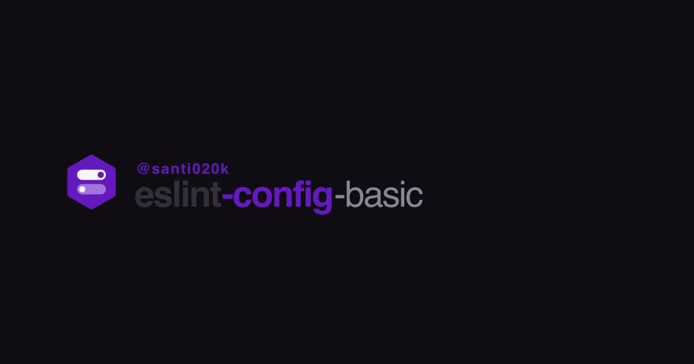

# @santi020k/eslint-config-basic

> **Start here:** Install from [npm](https://www.npmjs.com/package/@santi020k/eslint-config-basic) and follow the full guide at **[eslint.santi020k.com](https://eslint.santi020k.com/)** (canonical docs). This README summarizes features and philosophy.

[](https://github.com/santi020k/eslint-config-basic/actions/workflows/build.yml)
[](https://www.npmjs.com/package/@santi020k/eslint-config-basic)
[](https://www.npmjs.com/package/@santi020k/eslint-config-basic)
[](https://eslint.santi020k.com/)
[](https://github.com/santi020k/eslint-config-basic/blob/main/LICENSE)



Composable ESLint 10+ flat-config tooling for JavaScript and TypeScript projects, with optional framework packages for React, Next.js, Astro, Vue, Svelte, Solid, Angular, NestJS, Hono, Expo, Qwik, and Remix.

## Canonical Docs

- Docs site: [eslint.santi020k.com](https://eslint.santi020k.com/)
- Repository: [github.com/santi020k/eslint-config-basic](https://github.com/santi020k/eslint-config-basic)
- Author: [santi020k](https://santi020k.com)

## 🎯 Philosophy: DX Above All

This project follows a **DX-First & Stability-First** mission. We prioritize a seamless developer experience and reliable installations. To achieve this:

- **Handled Versioning**: Core packages like `eslint` and `@eslint/js` are included as hard dependencies. This ensures the config "just works" with tested versions, preventing the dreaded "peer dependency hell."
- **Broad Compatibility**: We support both **ESLint 9** and **ESLint 10** through flexible internal mapping and robust dependency management.

## ✨ Key Features

- **🎯 Composable & Modular**: Mix and match configurations for different frameworks and tools using a clean, options-based API.
- **🔍 Deep Auto-Detection**: Automatically detects your project's frameworks, libraries, and tools. Core features like TypeScript and runtime presets are enabled by default if detected.
- **⚡ Lazy Loading**: Framework-specific configurations are loaded only when needed.
- **🛡️ Strict Mode**: Opt-in `strict: true` to promote all warnings to errors, perfect for CI/CD and maintaining high code standards.
- **🌐 Smart Runtime Support**: Built-in support for Node.js, Browser, Worker, or Universal runtimes with appropriate globals and rules.
- **💅 Prettier Integrated**: Seamlessly integrated with Prettier out of the box for consistent code formatting.
- **🤖 Agent Skill Generator (Beta)**: Automatically generates tailored ESLint standards for AI agents (Cursor, Claude, Copilot, etc.) based on your active config. A non-breaking, opt-in feature to boost AI assistance.
- **🧩 Extensive Plugin Support**: Tailored rules for Tailwind CSS, Vitest, Testing Library, Storybook, TanStack (Query/Router), and more.

## 🚀 Quick Start

### Installation

```bash
npm install -D @santi020k/eslint-config-basic
```

*(No need to install `eslint` manually; it's handled as a dependency of the config to ensure the best DX!)*

### Usage

Create an `eslint.config.js` in your project root. By default, it will detect your project settings:

```js
import { eslintConfig } from '@santi020k/eslint-config-basic'

export default eslintConfig()
```

Optional integrations are loaded only when you enable them. A Node-only project can use the base config without installing unrelated peer packages such as Storybook, GraphQL, Cypress, or Testing Library.

### Comprehensive Example

Here is an example with many features activated. Note that many of these are automatically detected if the corresponding packages are in your `package.json`.

```js
import { eslintConfig, Extension, Format, Library, Testing, Tool } from '@santi020k/eslint-config-basic'
import next from '@santi020k/eslint-config-next'
import react from '@santi020k/eslint-config-react'

export default eslintConfig({
  // Explicitly enable TypeScript (auto-detected if tsconfig.json exists)
  typescript: true,

  // Strict mode: warnings become errors
  strict: true,

  // Frameworks (imports are lazy-loaded)
  frameworks: {
    react,
    next
  },

  // Optional integrations
  libraries: [Library.Tailwind, Library.TanstackQuery],
  testing: [Testing.Vitest, Testing.Playwright, Testing.TestingLibrary],
  formats: [Format.Mdx, Format.Jsonc, Format.Graphql],
  tools: [Tool.Prettier, Tool.Cspell],
  extensions: [Extension.Unicorn, Extension.Sonarjs, Extension.Perfectionist]
})
```

## Framework packages

- TypeScript: [`@santi020k/eslint-config-typescript`](https://eslint.santi020k.com/frameworks/typescript.html)
- React: [`@santi020k/eslint-config-react`](https://eslint.santi020k.com/frameworks/react.html)
- Next.js: [`@santi020k/eslint-config-next`](https://eslint.santi020k.com/frameworks/next.html)
- Astro: [`@santi020k/eslint-config-astro`](https://eslint.santi020k.com/frameworks/astro.html)
- Vue: [`@santi020k/eslint-config-vue`](https://eslint.santi020k.com/frameworks/vue.html)
- Svelte: [`@santi020k/eslint-config-svelte`](https://eslint.santi020k.com/frameworks/svelte.html)
- Solid: [`@santi020k/eslint-config-solid`](https://eslint.santi020k.com/frameworks/solid.html)
- Angular: [`@santi020k/eslint-config-angular`](https://eslint.santi020k.com/frameworks/angular.html)
- NestJS: [`@santi020k/eslint-config-nest`](https://eslint.santi020k.com/frameworks/nest.html)
- Hono: [`@santi020k/eslint-config-hono`](https://eslint.santi020k.com/frameworks/hono.html)
- Expo: [`@santi020k/eslint-config-expo`](https://eslint.santi020k.com/frameworks/expo.html)
- Qwik: [`@santi020k/eslint-config-qwik`](https://eslint.santi020k.com/frameworks/qwik.html)
- Remix: [`@santi020k/eslint-config-remix`](https://eslint.santi020k.com/frameworks/remix.html)

## 🤖 Agent Skill Generator (Beta)

The Agent Skill Generator is a new, **beta** feature designed to help AI coding assistants (like Cursor, Claude Code, Copilot, Windsurf, and Aider) understand and follow your project's specific ESLint standards.

It is **non-breaking** and strictly opt-in. It works by:
1. Scanning for agent-specific folders (e.g., `.cursor/rules`, `.claude/commands`).
2. Analyzing your `eslint.config.js` to see which frameworks and tools are active.
3. Generating a tailored `.md` or `.mdc` file that explains your coding conventions to the AI.

To use it, run:
```bash
npx @santi020k/eslint-config-basic generate-skill
```

*Note: Use `--force` to overwrite existing skill files.*

## Development

```bash
pnpm install    # Install dependencies
pnpm run build  # Build all packages
pnpm run test   # Run integration tests
pnpm run lint   # Run linting checks
pnpm run ok     # Run all checks
```

---

*Authored with ❤️ by [santi020k](https://santi020k.com)*
