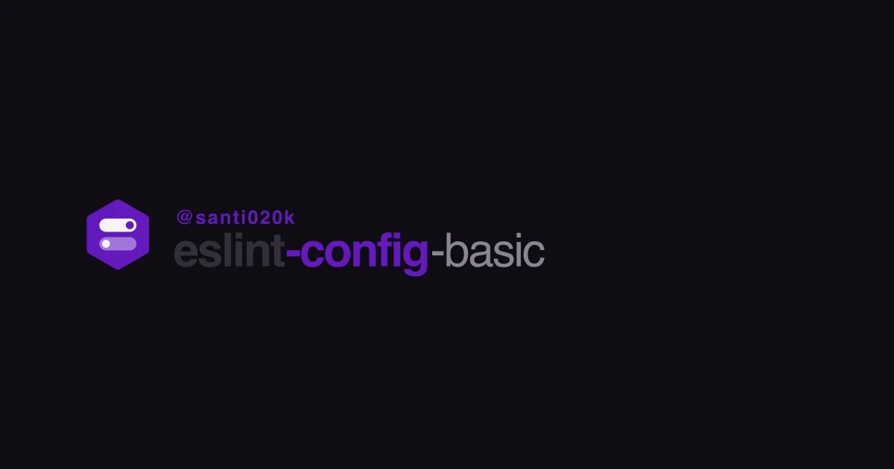

# @santi020k/eslint-config-basic

> **Start here:** Install from [npm](https://www.npmjs.com/package/@santi020k/eslint-config-basic) and follow the full guide at **[eslint.santi020k.com](https://eslint.santi020k.com/)** (canonical docs). This README summarizes features and philosophy.

[](https://github.com/santi020k/eslint-config-basic/actions/workflows/build.yml)
[](https://www.npmjs.com/package/@santi020k/eslint-config-basic)
[](https://www.npmjs.com/package/@santi020k/eslint-config-basic)
[](https://eslint.santi020k.com/)
[](https://github.com/santi020k/eslint-config-basic/blob/main/LICENSE)



Composable ESLint 10+ flat-config tooling for JavaScript and TypeScript projects, with optional framework packages for React, Next.js, Astro, Vue, Nuxt, Svelte, Solid, Angular, NestJS, Hono, Expo, Qwik, Remix, React Router, TanStack Start, Lit, Vite, and Slidev.

## Canonical Docs

- Docs site: [eslint.santi020k.com](https://eslint.santi020k.com/)
- Repository: [github.com/santi020k/eslint-config-basic](https://github.com/santi020k/eslint-config-basic)
- Author: [santi020k](https://santi020k.com)

## 🎯 Philosophy: DX Above All

This project follows a **DX-First & Stability-First** mission. We prioritize a seamless developer experience and reliable installations. To achieve this:

- **Handled Versioning**: Core packages like `eslint` and `@eslint/js` are included as hard dependencies. This ensures the config "just works" with tested versions, preventing the dreaded "peer dependency hell."
- **Modern Baseline**: Built for **ESLint 10** flat config, taking advantage of v10 improvements like per-file config lookup and JSX reference tracking.
- **Install Size, Explained**: Bundling every framework and plugin behind one install is a deliberate tradeoff — `node_modules` is larger, but versions are vetted together, installs never break on peer conflicts, and lazy loading means unused frameworks are never imported at lint time. For dependency-sensitive projects, `@santi020k/eslint-config-lite` keeps the same composer API while letting you install framework and integration config packages manually.

## Compatibility

| Runtime | Supported Version |
| :--- | :--- |
| Node.js | `>=22.18.0` |
| ESLint | `^10.0.0` |
| TypeScript | `>=5.0.0` when TypeScript linting is enabled |

`@santi020k/eslint-config-basic` owns the tested plugin set for the full install. Use `@santi020k/eslint-config-lite` when you want the same composer API but prefer to install framework and integration config packages yourself.

## ✨ Key Features

- **🎯 Composable & Modular**: Mix and match configurations for different frameworks and tools using a clean, options-based API.
- **🔍 Deep Auto-Detection**: Automatically detects your project's frameworks, libraries, and tools. Core features like TypeScript and runtime presets are enabled by default if detected.
- **🧩 Simple Optional Features**: Enable optional configs with enums, matching strings, or a single `features` boolean map.
- **⚡ Lazy Loading**: Framework-specific configurations are loaded only when needed.
- **🛡️ Strict Mode**: Opt-in `strict: true` to promote all warnings to errors, perfect for CI/CD and maintaining high code standards.
- **🌐 Smart Runtime Support**: Built-in support for Node.js, Browser, Worker, Cloudflare, Bun, Deno, and Universal runtimes with appropriate globals and rules.
- **🧭 Explainable Detection**: `basic-eslint explain` shows exactly which frameworks, runtimes, and integrations were detected.
- **🏗️ Monorepo Projects**: Scope presets and integrations per workspace folder with the `projects` option, or let `Preset.Monorepo` detect workspace packages.
- **💅 Prettier Integrated**: Seamlessly integrated with Prettier out of the box for consistent code formatting.
- **🤖 Agent Skill Generator (Beta)**: Automatically generates tailored ESLint standards for AI agents (Cursor, Claude Code, Copilot, Windsurf, Aider, Gemini, Cline, Roo Code, Kiro, and any `AGENTS.md`-based tool such as Codex CLI or OpenCode) based on your active config. A non-breaking, opt-in feature to boost AI assistance.
- **🧩 Extensive Plugin Support**: Tailored rules for AI SDK, OpenAI Agents SDK, Mastra, MCP, LangChain, LlamaIndex, Tailwind CSS, Vitest, Testing Library, Storybook, TanStack (Query/Router), and more.

## 🚀 Quick Start

### Installation

```bash
npm install -D @santi020k/eslint-config-basic
```

*(No need to install `eslint` manually; it's handled as a dependency of the config to ensure the best DX!)*

For a smaller opt-in install where you manage framework and integration packages yourself:

```bash
npm install -D @santi020k/eslint-config-lite eslint
```

### Usage

Create an `eslint.config.js` in your project root. By default, it will detect your project settings:

```js
import { defineConfig } from '@santi020k/eslint-config-basic'

export default await defineConfig()
```

Optional integrations are loaded only when you enable them. A Node-only project can use the base config without installing unrelated peer packages such as Storybook, GraphQL, Cypress, or Testing Library.

For a compact manual setup, use the `features` map. Set a key to `true` to enable an optional config, or `false` to disable one that was detected or enabled by a preset:

```js
import { defineConfig } from '@santi020k/eslint-config-basic'

export default await defineConfig({
  features: {
    boundaries: true,
    'github-actions': true,
    playwright: true,
    prettier: true,
    tailwind: true,
    unicorn: false,
    zod: true
  }
})
```

Inspect what v2 auto-detected:

```bash
npx @santi020k/eslint-config-basic explain
```

### Comprehensive Example

Here is an example with many features activated. Note that many of these are automatically detected if the corresponding packages are in your `package.json`.

```js
import { defineConfig, Extension, Format, Library, Testing, Tool } from '@santi020k/eslint-config-basic'

export default await defineConfig({
  extensions: [Extension.Unicorn, Extension.Sonarjs, Extension.Perfectionist, Extension.Boundaries],

  formats: [Format.Mdx, Format.Jsonc, 'graphql'],

  // Frameworks
  frameworks: {
    next: true,
    react: true
  },

  // Optional integrations
  libraries: [Library.AiSdk, Library.OpenAiAgents, Library.Mastra, Library.Mcp, Library.Tailwind, 'tanstack-query'],
  // Strict mode: warnings become errors
  strict: 'ci',
  testing: [Testing.Vitest, Testing.Playwright, 'testing-library'],
  tools: [Tool.Prettier, Tool.Cspell, Tool.GithubActions, Tool.Docker, Tool.Nx],
  // Explicitly enable strict TypeScript mode (auto-detected if tsconfig.json exists)
  typescript: 'strict'
})
```

### Monorepo Example

```js
import { defineConfig, Preset, Runtime } from '@santi020k/eslint-config-basic'

export default await defineConfig({
  preset: Preset.Monorepo,
  projects: {
    'apps/api': {
      preset: Preset.Library,
      runtime: Runtime.Node
    },
    'apps/web': {
      frameworks: { next: true },
      preset: Preset.App
    }
  }
})
```

## Framework packages

- TypeScript: [`@santi020k/eslint-config-typescript`](https://eslint.santi020k.com/frameworks/typescript.html)
- React: [`@santi020k/eslint-config-react`](https://eslint.santi020k.com/frameworks/react.html)
- Next.js: [`@santi020k/eslint-config-next`](https://eslint.santi020k.com/frameworks/next.html)
- Astro: [`@santi020k/eslint-config-astro`](https://eslint.santi020k.com/frameworks/astro.html)
- Vue: [`@santi020k/eslint-config-vue`](https://eslint.santi020k.com/frameworks/vue.html)
- Nuxt: [`@santi020k/eslint-config-nuxt`](https://eslint.santi020k.com/frameworks/nuxt.html)
- Svelte: [`@santi020k/eslint-config-svelte`](https://eslint.santi020k.com/frameworks/svelte.html)
- Solid: [`@santi020k/eslint-config-solid`](https://eslint.santi020k.com/frameworks/solid.html)
- Angular: [`@santi020k/eslint-config-angular`](https://eslint.santi020k.com/frameworks/angular.html)
- NestJS: [`@santi020k/eslint-config-nest`](https://eslint.santi020k.com/frameworks/nest.html)
- Hono: [`@santi020k/eslint-config-hono`](https://eslint.santi020k.com/frameworks/hono.html)
- Expo: [`@santi020k/eslint-config-expo`](https://eslint.santi020k.com/frameworks/expo.html)
- Qwik: [`@santi020k/eslint-config-qwik`](https://eslint.santi020k.com/frameworks/qwik.html)
- Remix: [`@santi020k/eslint-config-remix`](https://eslint.santi020k.com/frameworks/remix.html)
- React Router: [`@santi020k/eslint-config-react-router`](https://eslint.santi020k.com/frameworks/react-router.html)
- TanStack Start: [`@santi020k/eslint-config-tanstack-start`](https://eslint.santi020k.com/frameworks/tanstack-start.html)
- Lit: [`@santi020k/eslint-config-lit`](https://eslint.santi020k.com/frameworks/lit.html)
- Vite: [`@santi020k/eslint-config-vite`](https://eslint.santi020k.com/frameworks/vite.html)
- Slidev: [`@santi020k/eslint-config-slidev`](https://eslint.santi020k.com/frameworks/slidev.html)

## 🤖 Agent Skill Generator (Beta)

The Agent Skill Generator is a new, **beta** feature designed to help AI coding assistants (like Cursor, Claude Code, Copilot, Windsurf, Aider, Gemini, Cline, Roo Code, and Kiro) understand and follow your project's specific ESLint standards.

It is **non-breaking** and strictly opt-in. It works by:
1. Scanning for agent-specific folders (e.g., `.cursor/rules`, `.claude/commands`, `.clinerules`, `.roo/rules`, `.kiro/steering`, `.gemini`).
2. Analyzing your `eslint.config.js` to see which frameworks and tools are active.
3. Generating a tailored `.md` or `.mdc` file that explains your coding conventions to the AI.

It also maintains a guarded ESLint-standards section inside an existing root `AGENTS.md` (the open standard read by Codex CLI, OpenCode, Jules, Amp, and others) and inside `.github/copilot-instructions.md`.

To use it, run:
```bash
npx @santi020k/eslint-config-basic generate-skill
```

Useful flags:
- `--force` overwrites existing skill files.
- `--check` verifies skill files are up to date without writing (exits 1 when stale — ideal for CI).
- `--create` scaffolds a root `AGENTS.md` when the project has none.

Generated agent folders (`.claude/`, `.cursor/`, `.kiro/`, etc.) are ignored by the config's default ignore block, so agent artifacts are never linted as source code.

## v2 Migration Helpers

```bash
npx @santi020k/eslint-config-basic migrate
npx @santi020k/eslint-config-basic docs
```

`migrate` reports v1-to-v2 changes, and `docs` generates a project-local `ESLINT_STANDARDS.md` summary.

## Development

```bash
pnpm install    # Install dependencies
pnpm run build  # Build all packages
pnpm run test   # Run integration tests
pnpm run lint   # Run linting checks
pnpm run ok     # Run all checks
```

---

*Authored with ❤️ by [santi020k](https://santi020k.com)*
