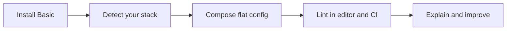

<p align="center">
  <a href="https://eslint.santi020k.com/">
    <picture>
      <source media="(prefers-color-scheme: dark)" srcset="https://raw.githubusercontent.com/santi020k/eslint-config-basic/main/assets/readme/hero-dark.svg">
      
    </picture>
  </a>
</p>

<h1 align="center">@santi020k/eslint-config-basic</h1>

<p align="center">
  <strong>A lean foundation for consistent JavaScript and TypeScript quality.</strong><br>
  Detect your stack. Add only what you need. Keep feedback useful.
</p>

<p align="center">
  <a href="https://www.npmjs.com/package/@santi020k/eslint-config-basic"></a>
  <a href="https://github.com/santi020k/eslint-config-basic/blob/main/LICENSE"></a>
  <a href="https://www.npmjs.com/package/@santi020k/eslint-config-basic"></a>
  <a href="https://github.com/santi020k/eslint-config-basic/actions/workflows/build.yml"></a>
  <a href="https://github.com/santi020k/eslint-config-basic/actions/workflows/codeql.yml"></a>
</p>

DX-first ESLint 10 flat config for JavaScript and TypeScript, with auto-detection
and opt-in framework packages.

<p align="center">
  <a href="https://eslint.santi020k.com/">Documentation</a> ·
  <a href="https://eslint.santi020k.com/guide/config-builder/">Config builder</a> ·
  <a href="https://www.npmjs.com/package/@santi020k/eslint-config-basic">npm</a> ·
  <a href="https://eslint.santi020k.com/guide/migration-v2-to-v3/">Migration to v3</a> ·
  <a href="https://github.com/santi020k/eslint-config-basic/issues/new/choose">Get help</a>
</p>

**Explore:** [Quick start](#quick-start) · [Why v3 changed dependency ownership](#why-v3-changed-dependency-ownership) · [Custom configuration](#custom-configuration) · [Package choice](#package-choice) · [CLI](#cli) · [Compatibility](#compatibility)

## Choose your path

| Your project | Start here | What stays in your control |
| --- | --- | --- |
| **JavaScript or TypeScript** | [Basic](https://eslint.santi020k.com/packages/basic/) | A lean foundation with automatic detection |
| **A framework application** | [Framework guides](https://eslint.santi020k.com/frameworks/react/) | Install the adapter for your actual stack |
| **Testing and tooling** | [Feature packs](https://eslint.santi020k.com/tooling/overview/) | Opt into the integrations you use |
| **Everything included** | [Full](https://eslint.santi020k.com/packages/full/) | One package owns the supported integrations |
| **An existing configuration** | [Interactive builder](https://eslint.santi020k.com/guide/config-builder/) | Preview choices before adopting them |

## Quick start

Install the lean package and ESLint:

```sh
npm install -D eslint @santi020k/eslint-config-basic
```

Create `eslint.config.mjs`:

```js
import { defineConfig } from '@santi020k/eslint-config-basic'

export default defineConfig()
```

That is the complete zero-config setup. It detects JavaScript, TypeScript,
runtime, and installed optional features relative to the config file, even when
an editor starts ESLint from another working directory.

For a framework, add its config package to the same install:

```sh
npm install -D eslint @santi020k/eslint-config-basic @santi020k/eslint-config-react
```

For optional behavior, add only the corresponding feature packs:

```sh
npm install -D @santi020k/eslint-config-testing @santi020k/eslint-config-tools
npm install -D @santi020k/eslint-config-libraries
```

If install size is not a concern, the batteries-included package keeps the same
one-line config:

```sh
npm install -D eslint @santi020k/eslint-config-full
```

```js
export { default } from '@santi020k/eslint-config-full/recommended'
```

## Why v3 changed dependency ownership

`@santi020k/eslint-config-basic` no longer installs every supported framework
and integration. Its production boundary is limited to the composer, core rules,
TypeScript support, and a small runtime utility. Frameworks and integrations are
optional peers loaded only when detected or selected.

This gives projects:

- fewer transitive dependencies and audit paths by default;
- no Angular, Expo, Storybook, GraphQL, Cypress, or Tailwind packages unless used;
- actionable errors naming an optional config package when it is missing;
- a full-package escape hatch for teams that prefer one dependency.

The lean security boundary is checked during release and has direct-dependency
budgets to prevent accidental growth.

## Custom configuration

Use the named factory when auto-detection needs an override:

```js
import { defineConfig } from '@santi020k/eslint-config-basic'

export default await defineConfig({
  root: import.meta.dirname,
  frameworks: { react: true },
  strict: 'ci',
  typescript: 'strict'
})
```

Optional features require their granular category package:

```js
import { defineConfig } from '@santi020k/eslint-config-basic'

export default await defineConfig({
  features: {
    playwright: true,
    prettier: true,
    tailwind: true
  }
})
```

The factory also accepts local flat-config overrides after the options object:

```js
import { defineConfig } from '@santi020k/eslint-config-basic'

export default await defineConfig({}, {
  files: ['scripts/**/*.js'],
  rules: { 'no-console': 'off' }
})
```

Pass overrides that reference optional plugin rules directly to `defineConfig()`
whenever possible. The composer attaches each already-loaded plugin to the rule
block that needs it. An entry appended after `defineConfig()` has returned is
outside that attachment pass; wrap a dynamically assembled final array with
`attachReferencedPlugins()`:

```js
import {
  attachReferencedPlugins,
  defineConfig
} from '@santi020k/eslint-config-basic'

const generated = await defineConfig()
const lateOverrides = await loadProjectOverrides()

export default attachReferencedPlugins([...generated, ...lateOverrides])
```

Direct calls from `eslint.config.*` automatically anchor dependency detection,
TypeScript, Tailwind, workspace packages, and `.gitignore` to that file. Set
`root` only when the intended project root differs from the config directory.

Type-aware projects can keep generated, template, or other out-of-project files
on syntax-only linting without importing `typescript-eslint`:

```js
export default await defineConfig({
  root: import.meta.dirname,
  typescript: {
    untypedFiles: ['templates/**/*.ts']
  }
})
```

TypeScript config files (`**/*.config.{ts,mts,cts}`) use this syntax fallback
automatically. Set `untypedFiles: false` to require type information everywhere.

## Formatting preferences

Choose common style preferences without repeating individual rule names:

```js
export default await defineConfig({
  formatting: {
    arrowParens: 'always',
    commaDangle: 'always-multiline',
    quotes: 'double',
    semi: true
  }
})
```

Every field is optional. `arrowParens` accepts `always` or `as-needed`,
`commaDangle` accepts `always-multiline` or `never`, `quotes` accepts `double` or
`single`, and `semi` is a boolean. Omitted fields retain existing defaults.
Preferences use warning severity; `strict: 'ci'` or `strict: 'pedantic'` promotes
them to errors. Correctness rules are unchanged. Prettier compatibility and local
flat-config overrides take precedence. Root preferences are inherited by
`projects`; each project can override individual fields. Use
`optionMergeStrategy: 'replace'` in a project to replace its inherited formatting
object instead of merging fields.

## Package choice

| Package | Use it when | Dependency model |
| --- | --- | --- |
| `@santi020k/eslint-config-basic` | Default for applications and libraries | Lean core; frameworks and integrations are optional |
| `@santi020k/eslint-config-full` | Install simplicity matters more than footprint | Every supported framework and integration |
| `@santi020k/eslint-config-lite` | Existing v2 lite users | Deprecated v3 compatibility path; removed in v4 |
| `@santi020k/eslint-config-integrations` | Existing aggregate-package users | Deprecated v3 compatibility path; removed in v4 |
| Individual framework packages | Custom composition | One framework and its plugin set |

## From setup to useful feedback



Detection starts from your configuration directory. Framework adapters and feature packs
stay explicit dependencies; lint feedback works in your editor and existing CI.
Use the CLI to understand a rule before changing it, and review a migration before writing it.

## CLI

```sh
npx @santi020k/eslint-config-basic init
npx @santi020k/eslint-config-basic explain no-console --file src/index.ts
npx @santi020k/eslint-config-basic doctor --fix
npx @santi020k/eslint-config-basic compatibility
npx @santi020k/eslint-config-basic config-types
npx @santi020k/eslint-config-basic migrate --to v3
npx @santi020k/eslint-config-basic baseline --preset pedantic
npx @santi020k/eslint-config-basic profile --max-warnings 0
npx @santi020k/eslint-config-basic snapshot
npx @santi020k/eslint-config-basic diff
```

`init` creates the zero-argument config. `explain` shows detection or traces an
effective rule, `doctor --fix` repairs safe setup issues with backups, and
`compatibility` validates runtime and peer ranges, while `config-types` checks
that editor-facing ESLint config declarations stay portable. The remaining
commands automate v3 migration, incremental strict-mode adoption, budgeted
performance profiling, and effective-rule change review.

Doctor's JSON project report includes `lintOwnership.localConfig`, `lintScript`,
and `guidance` to help review overlapping workspace lint commands. Doctor also
reports potentially redundant Astro parser and rule fields passed directly to
`defineConfig()` when the installed composer and current effective config agree
on sampled files. These are review candidates, never automatic removals.

When Playwright and Testing Library are both enabled, Playwright-owned globs
restrict Testing Library's import heuristics while retaining checks for actual
Testing Library imports. Use `testingFiles.playwright` for browser tests outside
the standard Playwright directories; generic `tests/**/*.spec.ts` files are not
assumed to belong to Playwright.

## Compatibility

- Node.js: `>=22.19.0`
- ESLint: `^10.0.0`
- TypeScript: `>=5.0.0 <7.0.0` when enabled
- Package managers: npm, pnpm, Yarn, and Bun

Packages in the `@santi020k/eslint-config-*` family use independent minor and
patch versions. Packages with the same major version are designed to work
together; use the latest release of each package within that major. Internal
dependency and peer ranges provide the exact machine-readable compatibility
requirements.

See the [v2 → v3 migration guide](https://eslint.santi020k.com/guide/migration-v2-to-v3/)
for package moves and copy-paste commands. The
[planned v4 removals](https://eslint.santi020k.com/guide/v4-removals/) page
tracks compatibility APIs that are deprecated during v3.

## Contribute and get support

- [Report a reproducible bug](https://github.com/santi020k/eslint-config-basic/issues/new/choose), ask a setup question, or propose a framework integration.
- [Read the contribution guide](https://github.com/santi020k/eslint-config-basic/blob/main/.github/CONTRIBUTING.md) for workspace setup, behavioral tests, and the release checks.
- [Report security vulnerabilities privately](https://github.com/santi020k/eslint-config-basic/blob/main/.github/SECURITY.md); keep credentials and private project data out of public issues.
- [Read the changelog](https://eslint.santi020k.com/guide/changelog/) before upgrading.

Built by [Santiago Molina](https://santi020k.com), alongside
[Lumen UI](https://github.com/santi020k/lumen),
[Quality](https://github.com/santi020k/quality), and
[Astro Doctor](https://github.com/santi020k/astro-doctor).

## License

MIT © [santi020k](https://santi020k.com). See [LICENSE](https://github.com/santi020k/eslint-config-basic/blob/main/LICENSE).
