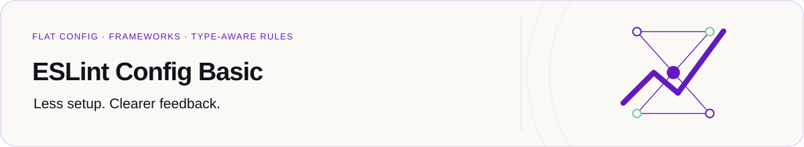

  <a href="../../README.md">
    <picture>
      <source media="(prefers-color-scheme: dark)" srcset="../../assets/readme/workspace-dark.svg">
      
    </picture>
  </a>

<h1 align="center">Contract tests</h1>

  
  

  <a href="../../README.md">Project overview</a> ·
  <a href="package.json">Package manifest</a> ·
  <a href="CHANGELOG.md">Changelog</a> ·
  <a href="#resources">Resources</a>

**On this page:** [Test isolation](#test-isolation) · [Workspace commands](#workspace-commands) · [Resources](#resources)

Internal integration and snapshot coverage for the monorepo.

This internal package is maintained inside the [`@santi020k/eslint-config-basic`](https://github.com/santi020k/eslint-config-basic) monorepo.

- Docs: [Tests package](https://eslint.santi020k.com/packages/tests/)
- Repository: [santi020k/eslint-config-basic](https://github.com/santi020k/eslint-config-basic)
- Author: [santi020k](https://santi020k.com)

The canonical documentation lives on the Astro Starlight site, so this README intentionally stays short to avoid duplication.

## Test isolation

Vitest uses forked workers for isolated integration and snapshot tests. The Windows
CLI and detection smoke job additionally uses `--maxWorkers=1` to limit process
contention; the full suite uses Vitest's configured worker defaults.

## Workspace commands

Run from the repository root after its documented setup. Use the Node.js and pnpm versions
declared in the root [package.json](../../package.json).

| Task | Command |
| --- | --- |
| Lint this workspace | `pnpm --filter @santi020k/eslint-config-tests run lint` |
| Check types | `pnpm --filter @santi020k/eslint-config-tests run typecheck` |
| Run workspace tests | `pnpm --filter @santi020k/eslint-config-tests run test` |

## Resources

[Project overview](../../README.md) · [Contributing](../../.github/CONTRIBUTING.md) · [License](../../LICENSE)
